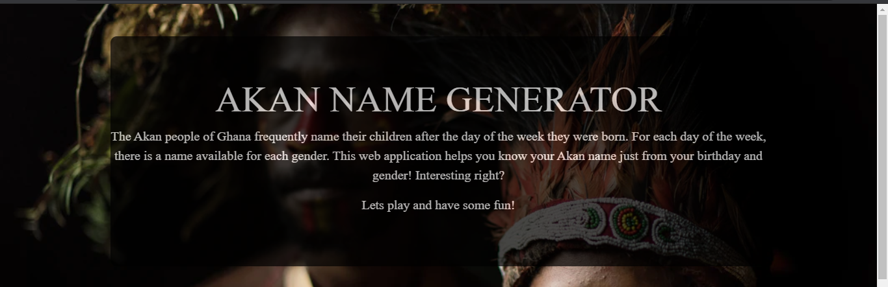
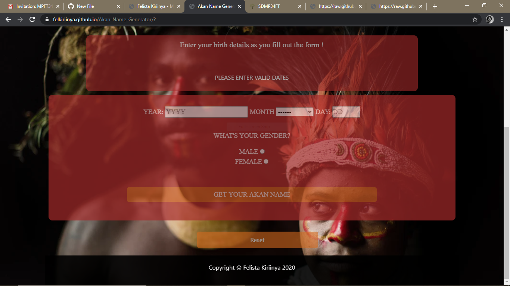
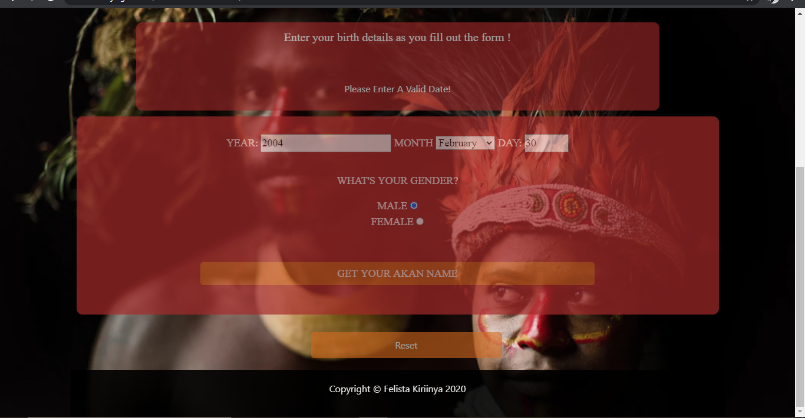
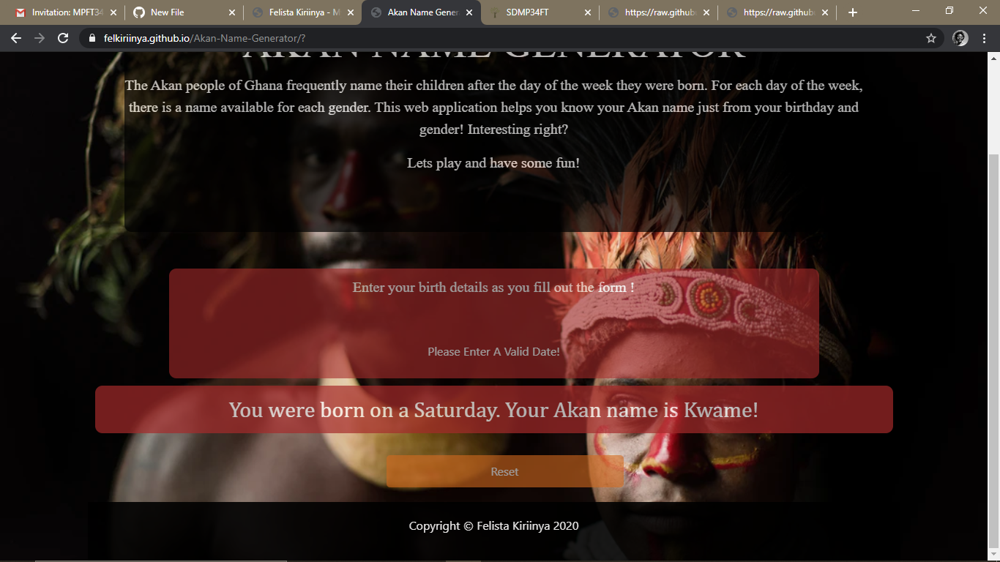
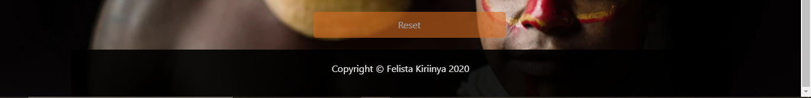

# Akan Name Generator
#### A web application that allows one to generate their Akan name,  19th August 2020
#### By **Felista Kiriinya**
## Description
This is a web application that gives a short brief on Akan names: their origin and how one is allocated an Akan name. The web app also allows one to generate their own Akan name

#### Data collection
The user is required to fill in their date, month and year of birth and also select their gender on the form provided.

#### Data validation
The user is also required to enter information in all fields and give valid dates, months and years and select at least one gender. If one of the above conditions is not met, a relevant error message is displayed as shown below:

#### Results
Once all the required inputs are validated and the user clicks the "Get Akan name" button to submit the information, the application generates the user's date of birth and their Akan name. The response is then displayed as shown below:

#### Reset
You can reset the form by clicking the reset button

## Development
To make advancements/modifications, follow these steps:

- Fork the repository
- Create a new branch (`git checkout -b improve-feature`)
- Make the appropriate changes in the files
- Add changes made
- Commit your changes (`git commit -am 'Improve feature'`)
- Push to the branch (`git push origin improve-feature`)
- Create a Pull Request 

## Want to know your Akan name?
My Akan name is Yaa! To find out yours, visit the web application by doing the following;
1. Check that your internet connection is active.
2. Click on this link https://felkiriinya.github.io/Akan-Name-Generator/?
3. You just found out your Akan name, cool right? Feel free to share the web application's link to your friends and family so that they can also know their Akan names!

## Technologies Used
This project is written in HTML, CSS and JavaScript.

## Support and contact details
Should you be unable to access my web application, have any recommendations or questions, feel free to email me; felkiriinya@gmail.com.

## To-do
1. Make web app mobile friendly
2. Make dates valid up until the date the website is being used (i.e reject dates that are in the future)

### License
*MIT
Copyright (c) 2020 **Felista Kiriinya**
